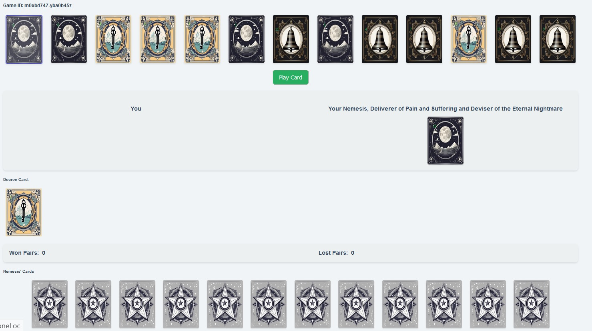

# Fox in the Forest

**Fox in the Forest** is a Java Spring-Boot implementation of the multiplayer card game, 

## Features:
- Contains secure login system, storing credentials on a PostgreSQL database.
- Contains multiplayer mode, allowing user to compete against other players.
- Contains AI mode, where the user competes against an AI opponent.
- Utilises Web-Sockets for real-time communication between players

## Technologies:
- **Backend:** Spring-Boot (Java), PostgreSQL
- **Frontend:** HTML, CSS, JavaScript
